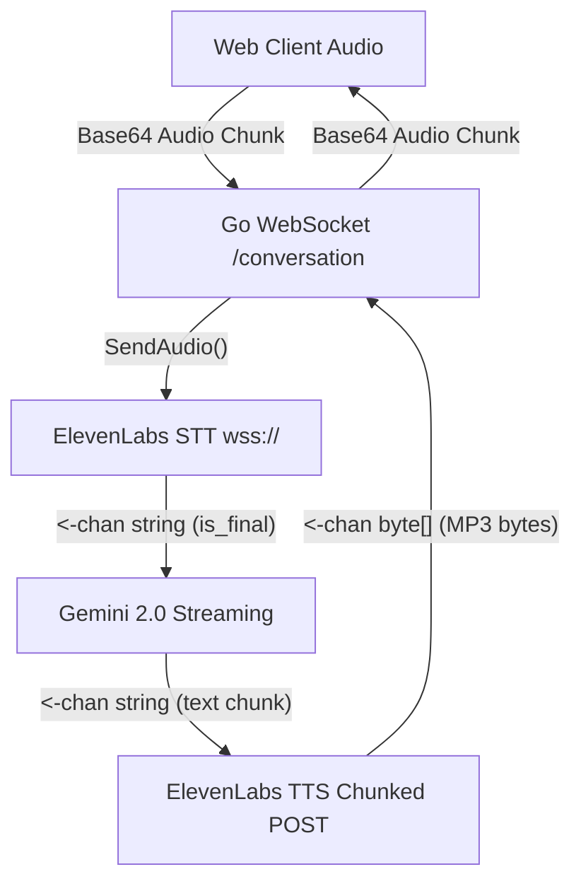

# Audio Module

O Audio Module é responsável por fornecer uma pipeline de comunicação de áudio bidirecional e de tempo real (WebSocket) combinando Speech-to-Text (STT), geração de linguagem natural (LLM) e Text-to-Speech (TTS).

## Arquitetura

O módulo é fortemente concorrente e gerencia múltiplos streams cruzados em Goroutines conectadas por canais do Go:

```
internal/audio/
├── model.go                      # Interfaces `SpeechToTextProvider`, `TextToSpeechProvider`, `LLMProvider`
├── processor/
│   └── pipeline.go               # Orquestrador central do WebSocket que liga in/outs.
├── service/
│   ├── elevenlabs_stt.go     # Integração WS Direto (`wss://api.elevenlabs.io...`)
│   ├── elevenlabs_tts.go     # Integração HTTP POST Stream (`POST /v1/text-...`)
│   └── gemini_llm.go         # Integração Gemini via GenerateStream()
└── tests/
    └── pipeline_test.go          # Testes simulando STT Mock->LLM Mock->TTS Mock
```

## Dependências
- `github.com/gorilla/websocket`: Usado para fazer o Upgrade da requisição HTTP `/conversation` do cliente Web no handler (`internal/http/handlers/audio.go`).
- `ELEVEN_API_KEY`: Necessária no ambiente para STT e TTS.

## Fluxo de Execução (Pipeline)

A execução acontece na estrutura `Pipeline.HandleWSConnection()` que roda nativamente até que o servidor ou o cliente fechem o link. O fluxo gerencia os loops abaixo ativamente e sincronizados.



### Eventos do Websocket
O Payload do Frontend precisa estar encapsulado em objetos JSON para identificação do backend.
```json
{
  "type": "audio",
  "audio": "<base64 PCM data>"
}
```

## Tratamento Assíncrono da ElevenLabs

- **STT**: Diferente do TTS, o Scribe v2 precisa da inicialização de um *Socket Bidirecional*. Portanto `Start()` aciona um `websockets.DialDialer` na Elevenlabs e a função `SendAudio()` empurra os Bytes nativos do client pela rede.
- **TTS**: O ElevenLabs requer que Textos gerados incrementalmente sejam enviados, mas reponde por byte streams numa abaica requisição POST HTTP. A assinatura do `TextToSpeechProvider` reflete chamadas únicas via `StreamText(context, text, out chan<- []byte)`. Todo Output é jogado no canal principal injetando Base64 para consumo direto no Browser!
