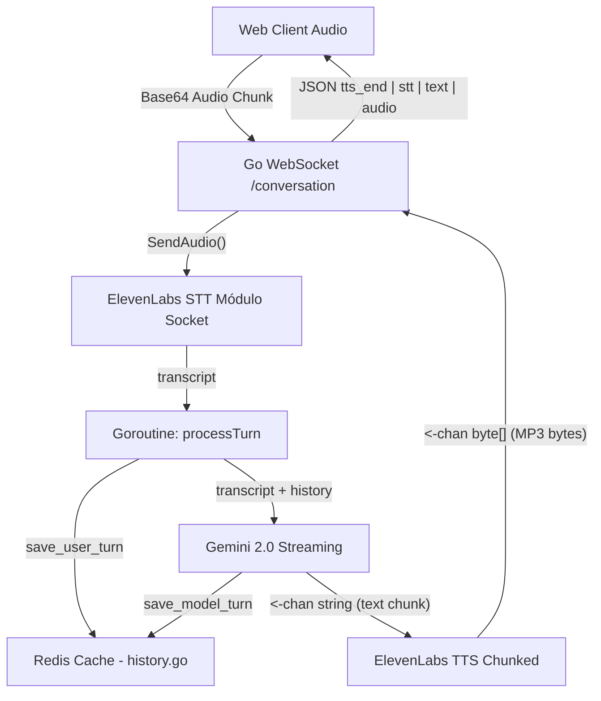

# Audio Module

O Audio Module é responsável por fornecer uma pipeline de comunicação de áudio bidirecional e de tempo real (WebSocket) combinando Speech-to-Text (STT), geração de linguagem natural com inteligência artificial (LLM) usando histórico contextual em cache, e Text-to-Speech (TTS).

## Arquitetura

O módulo é fortemente concorrente e gerencia múltiplos blocos do serviço divididos em Goroutines assíncronas gerenciadas por canais (Channels) nativos da linguagem Go dentro do seu orquestrador principal, o `processor`.

```
internal/audio/
├── model.go                      # Interfaces de Contrato (`STTSessionFactory`, `TextToSpeechProvider`, `LLMProvider`)
├── processor/
│   ├── history.go                # Sistema de manutenção de histórico injetando Redis Cache pra conversação do LLM
│   └── pipeline.go               # Orquestrador Master do WebSocket que une a leitura (STT), inferência (LLM) e injeção do áudio para fora (TTS)
├── service/
│   ├── elevenlabs_stt.go         # Integração Realtime via WebSocket (`wss://api.elevenlabs.io...`)
│   ├── elevenlabs_tts.go         # Integração Simples HTTP POST (`POST /v1/text-...`)
│   └── gemini_llm.go             # Integração Gemini suportando Histórico via GenerateStream()
└── tests/
    └── pipeline_test.go          # Testes simulando sub-pipelines de processamento.
```

*(Nota: Embora sub-diretórios `repository` e `routing` possam existir de resquícios, eles não detêm responsabilidade ativa no fluxo concorrente que agora vive atrelado integramente ao cache no `processor/history.go`)*

## Dependências
- `github.com/gorilla/websocket`: Usado para fazer o Upgrade da requisição HTTP `/conversation` do cliente Web (`internal/http/handlers/audio.go`).
- `extension-backend/internal/cache`: Cliente base do Redis para injetar o contexto e armazenar as chaves `conversation:{userId}` mantendo sessões fluídas e contínuas entre rodadas da fala (Turnos).
- `ELEVEN_API_KEY` & Chaves do Gemini: Necessárias ativas globalmente no container.

## Fluxo de Execução (Pipeline)

A execução acontece de forma isolada para cada Client dentro do sub-sistema da struct `Pipeline.HandleWSConnection()`. A leitura do STT cria uma Sessão e em seguida um "Turno da Fala" (`processTurn`) entra na trilha assíncrona até finalizar a resposta para o usuário. 



### Eventos do Websocket Bidirecional
A API do Audio Client requer os tipos mapeados para manter o ping/pong consistente:

**➡️ Enviado do Frontend:**
```json
{
  "type": "audio",
  "audio": "<base64 PCM data>"
}
// Outros suportados: "setup", "audio_end" (marcador final de fala)
```

**⬅️ Voltam pro Frontend via Pipeline WS:**
```json
// Confirmação de Transcrição
{
  "type": "stt",
  "text": "The dog is blue."
}

// Transmissão progressiva do modelo de Linguagem
{
  "type": "text",
  "text": " Yes, the dog is blue."
}

// Transmissão massiva de Áudio Pedaço-a-Pedaço gerado simultaneamente
{
  "type": "audio",
  "audio": "<base64 PCM data chunk>"
}

// Emissão terminal indicando o fim da frase respondida pela AI
{
  "type": "tts_end"
}
```

## Tratamento Assíncrono Dinâmico de Trilha

- **STT**: Por usar o Scribe v2 via Socket bidirecional da Elevenlabs, um `activeSession` é criado tardiamente apenas no primeiro pacote `audio` do turno da vida (Lazy Initialization). `audio_end` destrava a variável de contexto pra injetar o texto capturado para a fila LLM.
- **LLM/Caching**: Através do `GetHistory` no Redis, recuperamos as últimas 20 mensagens em rolling window do `userId`. As inferências respondem em stream pro Front via chunks com `"type": "text"` e o texto em sua magnitude final é salvo de novo no cache como originário do (`model`).
- **TTS**: Requer texto agrupado ou em parágrafos, recebe a String Final através do canal (`<-chan []byte`) e já injeta Bytes em base64 com `"type": "audio"` direto pra aba do Browser. Módulo extremamente concorrente.
