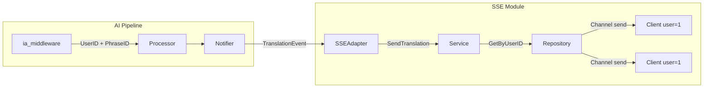

# SSE Module (Server-Sent Events)

O SSE Module fornece comunicação em tempo real, usado para enviar atualizações de tradução de IA para o cliente correto sem polling. Eventos são vinculados **por usuário** — cada cliente conecta com `?user_id=N` e recebe apenas os eventos destinados a ele.

## Structure

- **`hub.go`**: Gerencia conexões SSE, ping routine, e o handler HTTP. Exige `?user_id=N` no query param.
- **`service.go`**: Lógica de envio — `SendToUser`, `SendTranslation`, `SendError`, `BroadcastAll` (ping).
- **`repository/`**: Store in-memory de clientes conectados.
    - **`model.go`**: `Client` (com `UserID`), `Event`, `TranslationPayload`.
    - **`repository.go`**: `Add`, `Remove`, `GetByUserID`, `GetAll`, `Count`.

## Architecture



### Fluxo de Eventos

1. `ia_middleware.go` extrai `usuario_id` do body da request.
2. `Processor` propaga `UserID` do `Request` para o `Result`.
3. `Notifier` envia `TranslationEvent` com `UserID` para o `Broadcaster`.
4. `SSEAdapter` chama `Service.SendTranslation(userID, ...)`.
5. `Service` busca clientes pelo `userID` no `Repository` e envia via canal.

## Key Features

### 1. Per-User Binding
Cada `Client` possui `UserID`. O `Repository.GetByUserID()` retorna apenas os clientes daquele usuário. Isso garante que traduções do user 1 nunca vazem para o user 2.

### 2. Múltiplas Conexões por Usuário
Um usuário pode ter múltiplas abas/dispositivos conectados. `SendToUser` envia para **todos** os clientes do mesmo `UserID`.

### 3. Ping Keep-Alive
A cada 5s, o Hub envia `ping` para todos os clientes (via `BroadcastAll`), mantendo conexões vivas e detectando desconexões.

### 4. Cleanup Automático
Quando o contexto HTTP é cancelado (cliente desconecta), o `defer` no handler remove o client do repository e fecha o canal.

## Endpoints

| Método | Rota | Params | Descrição |
|--------|------|--------|-----------|
| `GET` | `/api/v1/sse/translations` | `?user_id=N` (obrigatório) | Abre conexão SSE para o usuário |

## Protocol Details

- **Headers**:
    - `Content-Type: text/event-stream`
    - `Cache-Control: no-cache`
    - `Connection: keep-alive`
    - `Access-Control-Allow-Credentials: true`
- **Events**:
    - `connected`: Handshake inicial — retorna `client_id` e `user_id`.
    - `ping`: Keep-alive a cada 5s com `timestamp` e `client_count`.
    - `translation`: Tradução completa — `phrase_id`, `traducao_completa`, `explicacao`, `fatias_traducoes`, `modelo_ia`.
    - `translation_error`: Erro na IA — `phrase_id`, `error`.

## Integration

- **AI Module**: `SSEAdapter` implementa `routing.Broadcaster`, conectando o pipeline de tradução ao SSE.
- **Extension**: Conecta via `EventSource` com `?user_id=N` para receber traduções em tempo real.
- **Hub ↔ Service**: `hub.GetService()` expõe o `Service` para uso externo (ex: `main.go` passa para `NewSSEAdapter`).

## Curl Tests

```bash
# Conectar como user 1
curl -N "http://localhost:8080/api/v1/sse/translations?user_id=1"

# Conectar como user 2 (outro terminal)
curl -N "http://localhost:8080/api/v1/sse/translations?user_id=2"

# Enviar frase como user 1 — apenas o terminal do user 1 recebe a tradução
curl -X POST http://localhost:8080/api/v1/phrases \
  -H "Content-Type: application/json" \
  -d '{"usuario_id":1,"conteudo":"hello world","idioma_origem":"en"}'

# Sem user_id → 400 Bad Request
curl -N "http://localhost:8080/api/v1/sse/translations"
```
